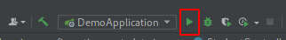

# Spring boot course 

This project serves as an introduction to create your first spring boot application.

## Pre-requisites
- install [PostgreSQL] (https://www.postgresql.org/download/)
- install [Maven] (https://maven.apache.org/download.cgi)
- install [IntellijIdea] (https://www.jetbrains.com/idea/download/#section=windows)
- Alternatively: install [Postman] (https://www.postman.com/), in order to test the student API

## Installation

Update the PostgreSQL configuration settings in [application.properties](src/main/resources/application.properties)

```SQL
create database springBootDemo;
create user demouser with password 'demouser' CREATEDB;
grant all privileges on database springBootDemo to demoUser;
```

Use the package manager [maven](https://maven.apache.org/download.cgi) to install the project dependencies.

```bash
mvn install
```

## Run
### Development mode
Option 1: You can use the utilities from your IDE



Option 2: You can run the application from command line

```bash
mvn spring-boot:run
```

### Deploy 

You need to execute the following commands to then obtain the jar

```bash
mvn clean
mvn install
```

Assuming that your project was named `myDemo`, navigate and copy the service jar file, e.g. demo-0.0.1-SNAPSHOT.jar
located in myDemo/target/demo-0.0.1-SNAPSHOT.jar